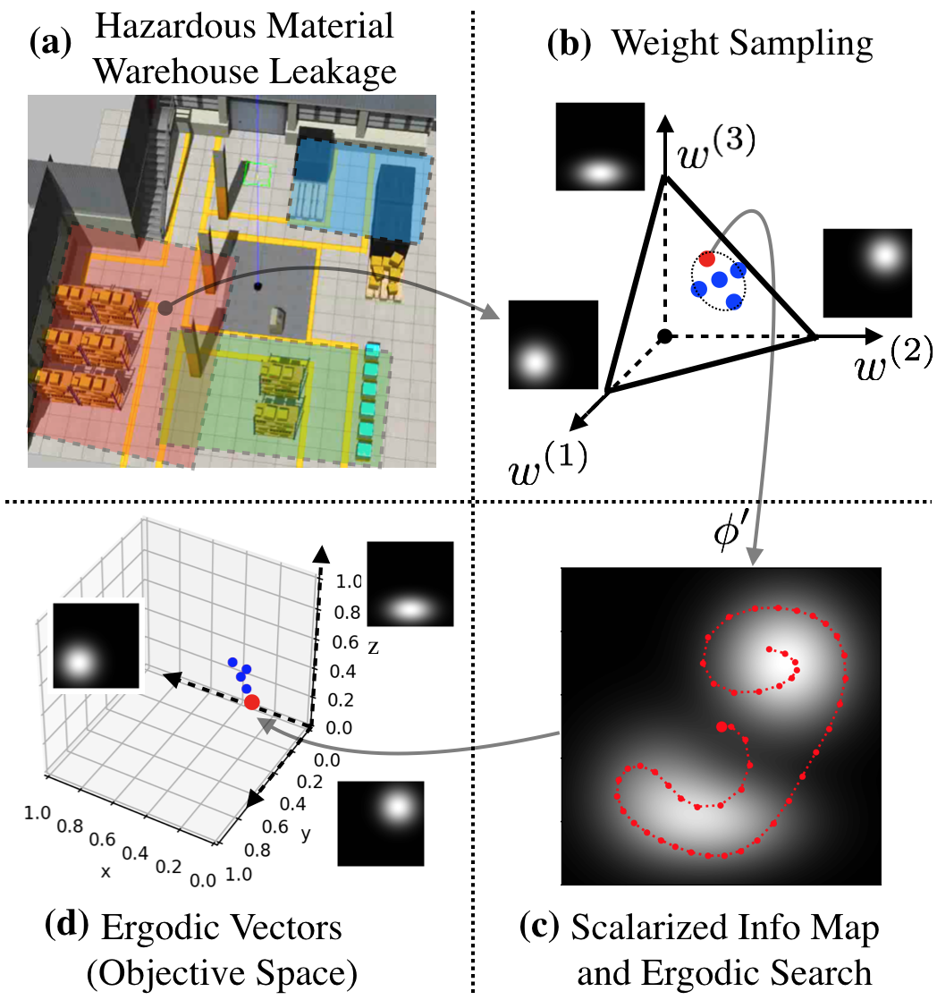

[[Google Scholar](https://scholar.google.com/citations?user=kKKvRXsAAAAJ&hl=en&oi=sra)] [[All bibtex](https://wonderren.github.io/files/all_bibtex.txt)] 

Journal
------

* 
Multi-Objective Path-Based D* Lite\
  **Zhongqiang Ren**, Sivakumar Rathinam, Maxim Likhachev and Howie Choset.\
  <i>IEEE Robotics and Automation Letters (RA-L)</i>, 2022.\
[[Bibtex](https://wonderren.github.io/files/bibtex_ren22mopbd.txt)]
[[Paper](https://ieeexplore.ieee.org/abstract/document/9697421)]
[[Arxiv](https://arxiv.org/pdf/2108.00710.pdf)]
<!-- [[Talk]()] -->
 
 
 
 

* 
Subdimensional Expansion for Multi-objective Multi-agent Path Finding\
	**Zhongqiang Ren**, Sivakumar Rathinam, and Howie Choset.\
	<i>IEEE Robotics and Automation Letters (RA-L)</i>, 2021.\
[[Bibtex](https://wonderren.github.io/files/bibtex_ren21momstar.txt)]
[[Paper](https://ieeexplore.ieee.org/document/9484849)]
[[Arxiv](https://arxiv.org/pdf/2102.01353.pdf)]
[[Talk](https://youtu.be/pfeBNvOqzvE)]
[[Code](https://github.com/wonderren/public_cppmomapf)]
 
 

Conference
------

* 
Conflict-Based Steiner Search for Multi-Agent Combinatorial Path Finding\
	**Zhongqiang Ren**, Sivakumar Rathinam, and Howie Choset.\
	<i>Robotics: Science and Systems (RSS)</i>, 2022.\
[[Bibtex](https://wonderren.github.io/files/bibtex_ren22cbss.txt)]
[[Paper](http://www.roboticsproceedings.org/rss18/p058.pdf)]
[[Code](https://github.com/wonderren/public_pymcpf)]
 
 

* 
A Local Optimization Framework for Multi-Objective Ergodic Search\
	**Zhongqiang Ren**, Akshaya Kesarimangalam Srinivasan, Howard Coffin, Ian Abraham and Howie Choset.\
	<i>Robotics: Science and Systems (RSS)</i>, 2022.\
[[Bibtex](https://wonderren.github.io/files/bibtex_ren22moes.txt)]
[[Paper](http://www.roboticsproceedings.org/rss18/p052.pdf)]
[[Code](https://github.com/wonderren/public_moes)]
 
 

* 
Loosely Synchronized Search for Multi-agent Path Finding with Asynchronous Actions\
	**Zhongqiang Ren**, Sivakumar Rathinam, and Howie Choset.\
	<i>IEEE/RSJ International Conference on Intelligent Robots and Systems (IROS)</i>, 2021.\
[[Bibtex](https://wonderren.github.io/files/bibtex_ren21lss.txt)]
[[Paper](https://ieeexplore.ieee.org/document/9636683)]
[[Arxiv](https://arxiv.org/pdf/2103.04516.pdf)]
[[Talk](https://youtu.be/u0WSXr3yjhc)]
 
 

* 
Multi-objective Conflict-based Search for Multi-agent Path Finding\
	**Zhongqiang Ren**, Sivakumar Rathinam, and Howie Choset.\
	<i>IEEE International Conference on Robotics and Automation (ICRA)</i>, 2021.\
[[Bibtex](https://wonderren.github.io/files/bibtex_ren21mocbs.txt)]
[[Paper](https://ieeexplore.ieee.org/document/9560985)]
[[Arxiv](https://arxiv.org/pdf/2101.03805.pdf)]
[[Talk](https://youtu.be/KI-BVhsjg0I)]
[[Code](https://github.com/wonderren/public_cppmomapf)]
 
 
 
 

* 
MS*: A New Exact Algorithm for Multi-agent Simultaneous Multi-goal Sequencing and Path Finding\
	**Zhongqiang Ren**, Sivakumar Rathinam, and Howie Choset.\
	<i>IEEE International Conference on Robotics and Automation (ICRA)</i>, 2021.\
[[Bibtex](https://wonderren.github.io/files/bibtex_ren21ms.txt)]
[[Paper](https://ieeexplore.ieee.org/document/9561779)]
[[PDF](https://arxiv.org/pdf/2103.09979)]
[[Talk](https://youtu.be/cjwO4yycfpo)]
 
 
 

* 
Geometric motion planning for systems with toroidal and cylindrical shape spaces\
	Chaohui Gong, **Zhongqiang Ren**, Julian Whitman, Jaskaran Grover, Baxi Chong, and Howie Choset.\
	Dynamic Systems and Control Conference, American Society of Mechanical Engineers, 2018.\
[[Bibtex](https://wonderren.github.io/files/bibtex_gong18torus.txt)]
[[Paper](https://asmedigitalcollection.asme.org/DSCC/proceedings-abstract/DSCC2018/51913/V003T32A013/270996)]
[[PDF](https://d1wqtxts1xzle7.cloudfront.net/57737478/DSCC2018-9144.pdf?1541912930=&response-content-disposition=inline%3B+filename%3DGeometric_Motion_Planning_For_Systems_Wi.pdf&Expires=1616924915&Signature=KuFlGSqfnphvOLhbK0Y33d4GZMikmQDXVFK1LDSjJ49hjrZof1sG8xlSdN-gVRQXcFqH9RSK4QV~7ly7Gp5OP9L5NiIqtJpL9XC80kV7gpl8-kGycqKsuy7T5viCGfuKTFeCUDu88YEaI60Ko9wKl8xgKXzHJDHc~L2SOCZfQic0iIw6Jr3Pp5e60X9C8Y2UvqlY8CnLrgOUc~TkN8w8t3kqUl~90KBEtKRvhiPJTk68D7dxPkf5ywee4a8wEDqmGezq34jkf1S4WyooKVlRxZ5LFbTGdVB75oVKgl1sqKi52LjsRanxeAHDqj~XsCGN4867qfEFV-uRnabb~iuN3g__&Key-Pair-Id=APKAJLOHF5GGSLRBV4ZA)]
 
 

* Deformed state lattice planning\
	**Zhongqiang Ren**, Chaohui Gong, and Howie Choset.\
	IEEE/RSJ International Conference on Intelligent Robots and Systems (IROS), 2017.\
[[Bibtex](https://wonderren.github.io/files/bibtex_ren17dslp.txt)]
[[Paper](https://ieeexplore.ieee.org/document/8206534)]
[[PDF](https://www.researchgate.net/profile/Zhongqiang-Ren/publication/321821716_Deformed_state_lattice_planning/links/5e9fdca6a6fdcc20bb360c44/Deformed-state-lattice-planning.pdf)]

Preprint
------

* Enhanced Multi-Objective A* Using Balanced Binary Search Trees\
  **Zhongqiang Ren**, Sivakumar Rathinam, Maxim Likhachev and Howie Choset.\
  <i>arXiv</i>\
[[Bibtex](https://wonderren.github.io/files/bibtex_ren22lbmp.txt)]
[[Arxiv](https://arxiv.org/pdf/2202.08992.pdf)]
[[Code](https://github.com/wonderren/public_emoa)]

* A Lower Bounding Framework for Motion Planning amid Dynamic Obstacles in 2D\
  **Zhongqiang Ren**, Sivakumar Rathinam and Howie Choset.\
  <i>arXiv</i>\
[[Bibtex](https://wonderren.github.io/files/bibtex_ren22emoa.txt)]
[[Arxiv](https://arxiv.org/pdf/2202.07409.pdf)]

* Subdimensional Expansion Using Attention-Based Learning For Multi-Agent Path Finding\
  Lakshay Virmani\*, **Zhongqiang Ren\***, Sivakumar Rathinam, and Howie Choset.\
  (\* indicates equal contribution)\
  <i>arXiv</i>\
[[Bibtex](https://wonderren.github.io/files/bibtex_virmani22lm.txt)]
[[Arxiv](https://arxiv.org/pdf/2109.14695.pdf)]
[[Video](https://youtu.be/if7kzJ9MAAg)]
[[Code](https://github.com/lakshayvirmani/learning-assisted-mstar)]

* Multi-objective Conflict-based Search Using Safe-interval Path Planning\
  **Zhongqiang Ren**, Sivakumar Rathinam, Maxim Likhachev and Howie Choset.\
  <i>arXiv</i>\
[[Bibtex](https://wonderren.github.io/files/bibtex_ren22mosipp.txt)]
[[Arxiv](https://arxiv.org/pdf/2108.00745.pdf)]
