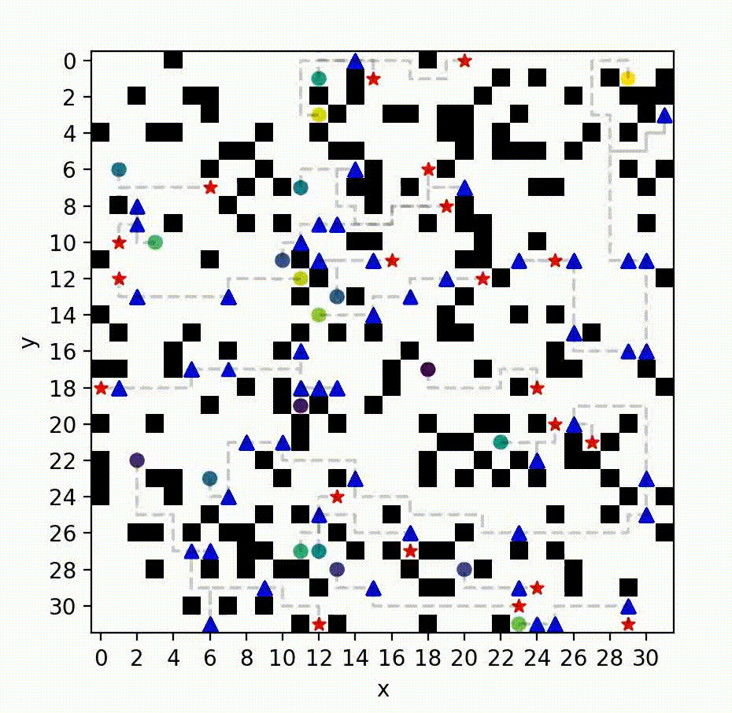
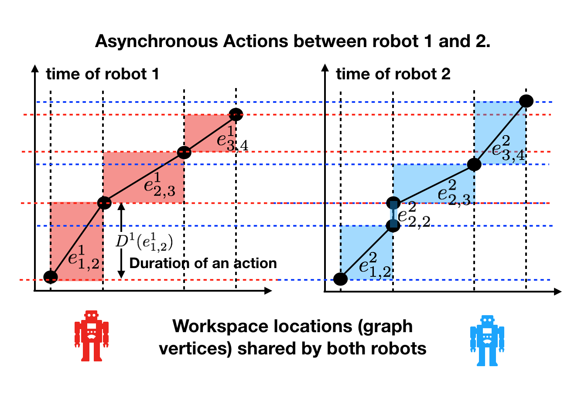
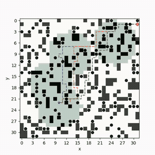

My research focuses on solving fundamental path and motion planning problems for single and multiple robots, by leveraging and advancing the frontier of multi-agent planning, combinatorial search and optimal control. These problems are often NP-hard, and my research exploits the underlying structure of these problems to develop algorithms that balance between runtime efficiency and solution quality guarantees, while being deployable to physical robots. These problems often arise in warehouse logistics, manufacturing and search-and-rescue. Most of my existing research is motivated by my experience prior to my PhD, where I co-founded a startup called [BITO Robotics](https://bitorobotics.com/en/) and was deeply involved in developing and deploying fleets of mobile robots in factories to transport materials.

Multi-Agent Path Planning
------
In structured and cluttered environments such as a factory, a team of robots with different capabilities (e.g. sensors or actuators) needs to move from one location to another for the purpose of information gathering or material transportation. The robots have to coordinate their motion to avoid collision while allocating each task to a robot with the right capability. To this end, as an extension of the existing techniques (such as multi-agent path finding, multiple traveling salesman problems, etc), we developed novel multi-agent path planners to solve problems that require (i) directing robots to visit multiple intermediate target locations [A1,A2], (ii) coordinating robots that move with different speeds [B1], (iii) computing solutions that trade-off between multiple path criteria [C1,C2]. These multi-agent planning problems are challenging due to the so-called curse of dimensionality as the search space grows exponentially w.r.t. the number of agents and the number of target locations to be visited. The key insight behind our algorithms is to dynamically modify (while attempting to bound) the dimension of the search space based on both the structure of the problem and the interaction between the robots. These algorithms advance the frontier of multi-agent planning by enabling new features for multi-agent systems while ensuring solution quality guarantees.

* [A1] 
Conflict-Based Steiner Search for Multi-Agent Combinatorial Path Finding\
	**Zhongqiang Ren**, Sivakumar Rathinam, and Howie Choset.\
	<i>Robotics: Science and Systems (RSS)</i>, 2022.\
[[Bibtex](https://wonderren.github.io/files/bibtex_ren22cbss.txt)]
[[Paper](../files/ren22_cbss_rss.pdf)]
[[Code](https://github.com/wonderren/public_pymcpf)]
[[talk](https://youtu.be/V17vQSZP5Zs?t=2853)]
 
 
 
 

* [A2] 
MS*: A New Exact Algorithm for Multi-agent Simultaneous Multi-goal Sequencing and Path Finding\
	**Zhongqiang Ren**, Sivakumar Rathinam, and Howie Choset.\
	<i>IEEE International Conference on Robotics and Automation (ICRA)</i>, 2021.\
[[Bibtex](https://wonderren.github.io/files/bibtex_ren21ms.txt)]
[[Paper](../files/ren21-MSstar.pdf)]
[[Talk](https://youtu.be/cjwO4yycfpo)]
 
 
 

* [B1] 
Loosely Synchronized Search for Multi-agent Path Finding with Asynchronous Actions\
  **Zhongqiang Ren**, Sivakumar Rathinam, and Howie Choset.\
  <i>IEEE/RSJ International Conference on Intelligent Robots and Systems (IROS)</i>, 2021.\
[[Bibtex](https://wonderren.github.io/files/bibtex_ren21lss.txt)]
[[Paper](../files/ren21_lss_iros.pdf)]
[[Talk](https://youtu.be/u0WSXr3yjhc)]
 
 

* [C1] 
A Conflict-Based Search Framework for Multi-Objective Multi-Agent Path Finding\
  **Zhongqiang Ren**, Sivakumar Rathinam and Howie Choset.\
  <i>IEEE Transactions on Automation Science and Engineering (T-ASE)</i>, 2022.\
[[Bibtex](https://wonderren.github.io/files/bibtex_ren22mocbs.txt)]
[[Paper](../files/ren22_mocbs_tase_final.pdf)]
[[Code](https://github.com/wonderren/public_cppmomapf)]
[[ICRA-2021 Talk](https://youtu.be/KI-BVhsjg0I)]
 
 
 
 

* [C2] 
Subdimensional Expansion for Multi-objective Multi-agent Path Finding\
	**Zhongqiang Ren**, Sivakumar Rathinam, and Howie Choset.\
	<i>IEEE Robotics and Automation Letters (RA-L)</i>, 2021.\
	(Presented at IROS-2021)\
[[Bibtex](https://wonderren.github.io/files/bibtex_ren21momstar.txt)]
[[Paper](../files/ren21-MOMstar_RAL_IROS.pdf)] 
[[Talk](https://youtu.be/pfeBNvOqzvE)]
[[Code](https://github.com/wonderren/public_cppmomapf)]
 
 

Multi-Objective Planning
------
Path planning often involves optimizing multiple conflicting objectives, such as fuel usage, path risk, arrivals times, etc. A common strategy is to take the weighted-sum of the objectives, which leads to a scalarized single-objective problem that can be solved by the existing algorithms. I believe that simply scalarizing the objectives (with some assumed weight) may often over-simplify the problem, and multi-objective planning techniques can identify the inherent trade-off between objectives and thus provide new insights about the task. A fundamental challenge in multi-objective planning is the large number of incomparable solutions (i.e. Pareto-optimal solutions), and we address this challenge by incrementally building a data structure during the computational process to efficiently manage the Pareto-optimal solutions. Consequently, our method expedites the existing multi-objective search techniques for up to an order of magnitude [D1]. We have also developed multi-objective planners to handle dynamic environments [D2,D3] that are common in robotics applications, and to address multi-agent multi-objective planning problems [C1,C2].

* [D1] 
Enhanced Multi-Objective A\* Using Balanced Binary Search Trees\
  **Zhongqiang Ren**, Richard Zhan, Sivakumar Rathinam, Maxim Likhachev and Howie Choset.\
  <i>International Symposium on Combinatorial Search (SoCS)</i>, 2022.\
[[Bibtex](https://wonderren.github.io/files/bibtex_ren22emoa.txt)]
[[Paper](../files/ren22_emoa_socs.pdf)]
[[Code](https://github.com/wonderren/public_emoa)]
 
 

* [D2] 
Multi-Objective Path-Based D* Lite\
  **Zhongqiang Ren**, Sivakumar Rathinam, Maxim Likhachev and Howie Choset.\
  <i>IEEE Robotics and Automation Letters (RA-L)</i>, 2022.\
  (Presented at ICRA-2022)\
[[Bibtex](https://wonderren.github.io/files/bibtex_ren22mopbd.txt)]
[[Paper](../files/ren22_mopbd-RAL_ICRA22.pdf)]
[[Talk](https://youtu.be/GVYLqTZpPLE)]
 
 
 

* [D3] 
Multi-Objective Safe-Interval Path Planning With Dynamic Obstacles\
  **Zhongqiang Ren**, Sivakumar Rathinam, Maxim Likhachev and Howie Choset.\
  <i>IEEE Robotics and Automation Letters (RA-L)</i>, 2022.\
  (Presentation at IROS-2022)\
[[Bibtex](https://wonderren.github.io/files/bibtex_ren22mosipp.txt)]
[[Paper](../files/ren22_mosipp_RAL_IROS22.pdf)]
 
 
 

Optimality Bounds in Motion Planning
------
One frequent question I received from manufacturers when I was in BITO was that “Can you improve the transportation efficiency of the mobile robots by 10%?”, which is a fair question as the solution quality directly affects the logistic costs and hence the profits. It turns out that this question is hard to answer since there is no method to obtain the true optimum for many motion planning problems in real-world with continuous space and time. To address the challenge, we started by developing an approach that can compute tight lower bounds (of the true optimum) for a motion planning problem in continuous space and time among dynamic obstacles [E1]. The lower bounding method here differs from the vast majority of existing methods (such as A*, RRT, etc) that compute a feasible solution, whose cost is an upper bound of the true optimum. The key insight behind the approach is to systematically generate relaxed problems whose solution costs are lower bounds that asymptotically converge to the true optimum. The computed tight lower bounds can help estimate how far a feasible solution deviates from the true optimum and thus provide “performance certificates” of the feasible solution executed by the robot.

* [E1] 
A Lower Bounding Framework for Motion Planning amid Dynamic Obstacles in 2D\
  **Zhongqiang Ren**, Sivakumar Rathinam and Howie Choset.\
  <i>Workshop on Algorithmic Foundations of Robotics (WAFR)</i>, 2022.\
[[Bibtex](https://wonderren.github.io/files/bibtex_ren22lbmp.txt)]
[[Paper](../files/ren22_lbmp_wafr.pdf)]
[[talk](https://youtu.be/gM_w2HAYJww?t=28388)]
 
 
 
 

Ergodic Coverage
------

Hazardous materials leakage can lead to heavy economic losses or casualties in manufacturing and warehousing (e.g. the semiconductor industry as shown in Fig.1 (d)). The search and rescue mission in this scenario often involves conflicting objectives such as localizing the leakage sources while finding survivors. We formulate and solve a multi-objective trajectory optimization problem that aims to find ergodic trajectories with respect to multiple information maps [F1]. Here, each information map is a probability distribution that encodes one type of information (such as possible locations of leakage or survivors), and a trajectory is ergodic w.r.t. an information map if the amount of time spent in each region is proportional to the amount of information in that region. We develop a framework that can leverage the existing single-objective ergodic search methods while providing theoretic guarantees on the Pareto-optimality of the computed solution.

* [F1] 
A Local Optimization Framework for Multi-Objective Ergodic Search\
	**Zhongqiang Ren**, Akshaya Kesarimangalam Srinivasan, Howard Coffin, Ian Abraham and Howie Choset.\
	<i>Robotics: Science and Systems (RSS)</i>, 2022.\
[[Bibtex](https://wonderren.github.io/files/bibtex_ren22moes.txt)]
[[Paper](../files/ren22_moes_rss.pdf)]
[[Code](https://github.com/wonderren/public_moes)]
[[talk](https://youtu.be/A6rRCVtB2sM?t=1548)]
 
 
 
 

